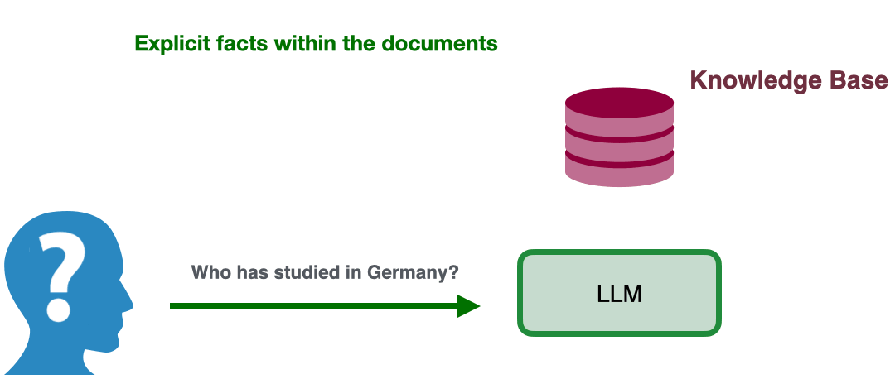

# 📚 ImpliRet: Benchmarking the Implicit Fact Retrieval Challenge


[](https://arxiv.org/abs/2506.14407)
[](https://huggingface.co/datasets/ZeinabTaghavi/ImpliRet)
[](https://colab.research.google.com/github/ZeinabTaghavi/ImpliRet/blob/master/notebook.ipynb)


**ImpliRet** (**Impli**cit Fact **Ret**rieval) is a six-subset benchmark that shifts the reasoning burden from
the *query* to the *documents themselves*. A query is always simple (e.g. *“Who visited a museum on October 06 2024?”*) but the relevant document
contains the answer **only implicitly**—via:

<p align="center">
  
</p>


 

---
<details open>
<summary>Table of Contents</summary>

- [📈 Results](#-results)
- [📂 Dataset](#dataset)
- [🛠️ Benchmarks & Baselines](#benchmarks)
- [📓 Quick-start Notebook](#quick-start-notebook)
- [👟 Contributing](#-contributing---run-your-own-retriever)
- [📜 Citation](#-citation)
</details>

---
## 📈 Results


<details open>
<summary><strong>🔬 Retrieval & RAG Results (click to collapse)</strong></summary>

The table below reports **nDCG@10** (↑ higher is better) for our baseline retrievers.

<div align="center">

| Retriever | W. Know. | Arithmetic | Temporal | Average |
|-----------|:-------:|:----------:|:--------:|:-------:|
| ***Sparse*** |  |  |  |  |
| BM25 | 14.10 | 11.06 | 11.22 | 12.13 |
| ***Late Interaction*** |  |  |  |  |
| ColBERT v2 | 16.04 | 14.93 | 12.20 | 14.39 |
| ***Dense Encoders*** |  |  |  |  |
| Contriever | 16.15 | 13.84 | 12.59 | 14.19 |
| Dragon+ | 17.15 | **14.61** | 12.53 | 14.76 |
| ReasonIR‑8B | **19.53** | 10.74 | **14.93** | **15.07** |
| ***Knowledge‑Graph‑Augmented*** |  |  |  |  |
| HippoRAG 2 | 16.38 | 14.21 | 12.50 | 14.36 |

</div>
*Table 2. nDCG@10 retrieval performance averaged over uni‑speaker and multi‑speaker documents.*
</details>

<details open>
<summary><strong>🧩 RAG‑style Evaluation</strong></summary>

The table below shows **ROUGE‑1 recall** (R‑1@k) for two long‑context LLM readers when the top‑*k* retrieved documents (oracle setting) are supplied.

<div align="center">

| Experiment | *k* | W. Know. | Arithmetic | Temporal | Average |
|------------|:---:|:--------:|:----------:|:--------:|:-------:|
| **Llama 3.3 70B** | 1   | **73.79** | **90.13** | **81.85** | **81.92** |
|                | 10  | 27.37 | 16.98 | 25.23 | 23.19 |
|                | All | 17.43 | 4.42  | 10.29 | 10.71 |
| **GPT‑4.1**     | 1   | **93.24** | **92.12** | **84.90** | **88.05** |
|                | 10  | 62.21 | 23.86 | 15.59 | 35.06 |
|                | All | 53.91 | 9.28  |  6.93 | 22.90 |

</div>

*Table 3. ROUGE‑1 recall (R‑1@k), averaged over uni‑speaker and multi‑speaker documents.*

</details>


---


## Dataset

You can load the `ImpliRet` dataset via [🤗 **Hugging Face**](https://huggingface.co/datasets/ZeinabTaghavi/ImpliRet) like this:

- **Repository**: `zeinabTaghavi/ImpliRet`
- **Reasoning Categories** (`split`): `arithmetic`, `wknow`, `temporal`
- **Discourse styles** (`name`): `multispeaker`, `unispeaker`

```python
from datasets import load_dataset

ds = load_dataset(
    "zeinabTaghavi/ImpliRet",
    name="multispeaker",   # or "unispeaker"
    split="arithmetic"     # wknow | temporal
)

print(ds.features)        # quick schema check
print(ds[0]["question"])  # sanity sample
```

## Benchmarks


### 1- Cloning and Instructing Requirements

```bash
# clone & install
$ git clone https://github.com/ZeinabTaghavi/ImpliRet.git
$ cd ImpliRet
$ python -m venv impliret_env && source impliret_env/bin/activate
$ pip install -r requirements.txt
```

---

#### Repository map

```
├── RAG_Style/     
│   ├── experiment_configs   # Config of RAG with retrievals or Oracle retriever
│   ├── model_configs        # Config of each LLM that will be used in RAG_Style 
│   ├── script               # Codes of Asyncron and Syncron experiments
│   ├── results              
│   └── reports
├── Retrieval/         
│   ├── retrievals           # Codes of each experiment
│   ├── results
│   └── reports
└── README.md             
```


### 2. Evaluate retrieval baselines

Runing the retrievals for generating the indexes:
The retrievals: BM25s, ColBertV2, Contriever, DragonPlus, HippoRagV2, ReasonIR.

Example of running:
running the retriever and reporting with `bash Retrieval/retrieve.sh` that is doing the following in detail:
```bash
# Running the retrieval for indexing
python ./Retrieval/retrieve_indexing.py  --output_folder ./Retrieval/results/ --category arithmetic --discourse multispeaker --retriever_name bm25

# Reporting
python Retrieval/reporting.py
```

Indexing results are written to `Retrieval/results`.
Reports(MRR, nDCG\@10…) are being stored in `Retrieval/reports`.

#### ⚠️ For runing HippoRAG2 and ReasonIR, we used 4 A100 GPUS.
---

### 3. Evaluating RAG Style baselines

Here we try Long context and RAG, the setting of the experiments configs are in the `RAG_Style/experiment_configs` folder, the  config of models are also stored in `RAG_Style/model_configs`.

#### Running the Experiment

You can have 3 setups for rinning this experiment:

1- Loading the model locally, using vllm with `bash RAG_Style/s_run_tests.sh` that does the following in detail:

```bash
# example with Llama3.3 70-B 
export HF_HOME=...
export HF_TOKEN= ...
python ./RAG_Style/scripts/sync/sync_run_tests.py \
       --config ./RAG_Style/experiment_configs/bm/A_Multi_llama_bm_1.yaml

```
2- loading the vllm on server with `bash RAG_Style/async_run_multi_llama.sh` that does the following in detail:
```bash 
export HF_HOME=...
export HF_TOKEN= ...
# ------------------------------------------------------------------
# Start vLLM server via helper script (background) and wait for load
# ------------------------------------------------------------------
# run_tests.sh  (top of file)
PROJECT_ROOT=...  # adjust once
source "$PROJECT_ROOT/scripts/async/start_vllm.sh"

echo "Starting the job" 
python ./RAG_Style/scripts/async/async_run_tests.py \
       --config ./RAG_Style/experiment_configs/oracle_retriever/A_Multi_llama_1.yaml


# ------------------------------------------------------------------
# Shut down the vLLM server
# ------------------------------------------------------------------
echo "Stopping vLLM server (PID=$VLLM_PID)"
kill $VLLM_PID
wait $VLLM_PID 2>/dev/null

```

3- Using other models like GPT that does not need the server loading with `RAG_Style/async_run_multi_GPT.sh` or in detail: 
The outputs will be hashed and store in `Experiments/evaluation/results`
```bash
python RAG_Style/scripts/async/async_run_tests.py \
       --config RAG_Style/experiment_configs/oracle_retriever/A_Multi_GPT_1.yaml
```
#### Evaluating the RAG_Style results

you can have the reporing of RAG with the following command:
```bash
# Reporing the resutls:
python RAG_Style/scripts/reporing.py
```
The results will be stored at `RAG_Style/results` folder.

---
## 👟 Contributing - Run your own retriever!

For running your own retriever follow the instruction in the notebook!
For adding to the Github, just send me your scripts! zeinabtaghavi1377@gmail.com

---
## 📜 Citation

```bibtex
@misc{taghavi2025impliret,
  author={Zeinab Sadat Taghavi and Ali Modarressi and Yunpu Ma and Hinrich Sch{\"u}tze},
  keywords = {Computation and Language (cs.CL),  Artificial Intelligence (cs.AI),  FOS: Computer and information sciences,  FOS: Computer and information sciences},
  title = {ImpliRet: Benchmarking the Implicit Fact Retrieval Challenge},
  year = {2025},
}